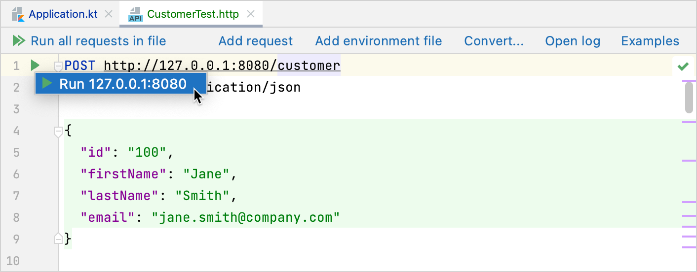

# 【HTTP APIの作成】

### [依存関係]

```kotlin
dependencies {
    implementation("io.ktor:ktor-server-core:$ktor_version")
    implementation("io.ktor:ktor-server-netty:$ktor_version")
    implementation("io.ktor:ktor-serialization:$ktor_version")
    implementation("ch.qos.logback:logback-classic:$logback_version")

    testImplementation("io.ktor:ktor-server-tests:$ktor_version")
    testImplementation("org.jetbrains.kotlin:kotlin-test-junit:$kotlin_version")
}
```

- `ktor-server-core`  
  Ktorのコアコンポーネントをプロジェクトに追加します。


- `ktor-server-netty`  
  Nettyエンジンをプロジェクトに追加し、外部アプリケーションコンテナに依存せずにサーバー機能を使用できるようにします。


- `logback-classic`  
  SLF4Jの実装を提供し、コンソールで適切にフォーマットされたログを表示できるようにします。


- `ktor-serialization`  
  KotlinオブジェクトをJSONのようなシリアル化された形式に、またはその逆に変換するための便利なメカニズムを提供します。これを使用して、API出力をフォーマットし、JSONで構造化されたユーザー入力を使用します。ktor-serializationを使用するには、org.jetbrains.kotlin.plugin.serializationプラグインも適用する必要があります。


- `ktor-server-test-host`  
  プロセスでHTTPスタック全体を使用しなくても、Ktorアプリケーションの一部をテストできます。これを使用して、プロジェクトの単体テストを定義します。

### [構成：application.confおよびlogback.xml]

リポジトリには、resourcesフォルダーにあるHOCON形式の`application.conf`も含まれています。<l>
Ktorはこのファイルを使用して、実行するポートを決定し、アプリケーションのエントリポイントも定義</l>します。

同じフォルダーには、サーバーの基本的なログ構造を設定する`logback.xmlも含まれています。

### [エントリーポイント]

`application.conf`は、アプリケーションのエントリポイントをcom.jetbrains.handson.website.ApplicationKt.moduleに構成します。<sl>**
application.confは、Application.ktの`Application.module（）関数`に対応**しますが、現在は何も実行していません</sl>。

```kotlin
fun main(args: Array<String>): Unit = io.ktor.server.netty.EngineMain.main(args)

fun Application.module() {}
```

APIのルーティングを定義するためには、アプリケーションのエントリポイントは重要です。

## 【Customerアプリケーション】

学習のためCustomerアプリケーション作成します。<sl>Customerに関連付けられているデータを定義するモデルを作成する必要</sl>があります。また、 Customerを追加、一覧表示、および削除できるように、一連のエンドポイントを作成します。

### [Customerモデル]

モデルを作成する場合、Customerはいくつかの基本情報をテキスト形式で保存する必要があります。Customerには、識別ID、姓名、および電子メールアドレスを用意します。 Kotlinでモデル化するには、`dataクラス`
を使用します。modelsという名前の新しいパッケージにCustomer.ktというファイル名を作成し、以下を追加します。

```kotlin
import kotlinx.serialization.Serializable

@Serializable
data class Customer(val id: String, val firstName: String, val lastName: String, val email: String)
```

kotlinx.serializationの`@Serializableアノテーション`を使用していることに注意してください。
<l>Ktorは、APIレスポンスに必要なJSON形式を自動的に生成</l>します。

### [Customerをルーティングを定義する]

/customerエンドポイントでのGET、POST、およびDELETEリクエストに対してレスポンスします。対応するHTTPメソッドを使用してルートを定義しましょう。ルートと呼ばれる新しいパッケージにCustomerRoutes.ktというファイルを作成し、次のように入力します

CustomerRoutes.kt

```kotlin
fun Route.customerRouting() {
    route("/customer") {
        get { }
        get("{id}") { }
        post { }
        delete("{id}") { }
    }
}
```

`route関数`は、<l>該当するすべてのエンドポイントをグループ化</l>します。HTTPメソッドそれぞれ作成し、ブロック内に処理を記述します。これは、ルートを構成する方法の1つにすぎません。

getのエントリが2つあることに注意してください。1つはルートパラメータなし、もう1つは{id}ありです。最初のエントリを使用してすべてのCustomerを一覧表示し、2番目のエントリを使用して特定のCustomerを表示します。

### [ContentNegotiation]

すべてのCustomerを一覧表示するには、Ktorの`call.respond関数`を使用してcustomerStorageリストを返すだけです。 Kotlinオブジェクトを受け取り、指定された形式でシリアル化して返すことができます。

<l>JSONのシリアライズ, デシリアライズをするためには`ContentNegotiation`を使用</l>します。<sl>
クライアントがリクエストを行うと、ContentNegotiationにより、サーバーはAcceptヘッダーを調べて、この特定のタイプのコンテンツを提供できるかどうかを確認し、提供できる場合は結果を返します</sl>。

```kotlin
get {
    if (customerStorage.isNotEmpty()) {
        call.respond(customerStorage)
    } else {
        call.respondText("No customers found", status = HttpStatusCode.NotFound)
    }
}
```

<sl>ContentNegotiationプラグインをインストールし、JSONのサポートを有効</sl>にします。Application.module（）関数にContentNegotiationを追加します。

```kotlin
fun Application.module() {
    install(ContentNegotiation) {
        json()
    }
}
```

Ktorでは、パスに特定のパスセグメントに一致するパラメーターを含めることもできます。`インデックス付きアクセス演算子`（call.parameters ["myParamName"]）を使用してそれらの値にアクセスできます。get（ "
{id}"）エントリに追加します。

```kotlin
get("{id}") {
    val id = call.parameters["id"] ?: return@get call.respondText(
        "Missing or malformed id",
        status = HttpStatusCode.BadRequest
    )
    val customer =
        customerStorage.find { it.id == id } ?: return@get call.respondText(
            "No customer with id $id",
            status = HttpStatusCode.NotFound
        )
    call.respond(customer)
}
```

リクエストにパラメータIDが存在するかどうかを確認します。存在しない場合は、`400の「Bad request」`とエラーメッセージで応答し、パラメータが存在する場合は`customerStorage`
で対応するレコードを見つけようとします。見つかった場合は、オブジェクトで応答します。それ以外の場合は、エラーメッセージとともに`404「Not Found」`が返されます。

<sl>idがnullの場合は`400の「Bad request」`を返しますが、実際にはこのケースに遭遇することはないことに注意</sl>してください。**
リクエスト時にパラメータを指定するため、パラメータ{id}が渡されることはありません**。

### [Customerを作成する]

クライアントがクライアントオブジェクトのJSON表現をPOSTするオプションを実装します。これは、Customerのストレージに配置されます。

```kotlin
post {
    val customer = call.receive<Customer>()
    customerStorage.add(customer)
    call.respondText("Customer stored correctly", status = HttpStatusCode.Created)
}
```

`call.receive`は、前のセクションの1つを構成したContentNegotiationプラグインと統合されています。<l>ジェネリックパラメーターCustomerを使用して呼び出すと、**
JSONリクエストの本文が自動的にKotlinCustomerオブジェクトに逆シリアル化**</l>
されます。その後、Customerをストレージに追加し、ステータスコード201「作成済み」で応答できます。このチュートリアルでは同時にストレージにアクセスする複数のリクエスト、本番環境では複数のリクエスト/スレッドから同時にアクセスできるケースを考慮する必要があります。

### [Customerを削除する]

Customerを削除するための実装は、特定のCustomerをリストするために使用したものと同様の手順で行います。最初にIDを取得し、それに応じてcustomerStorageを変更します。

```kotlin
delete("{id}") {
    val id = call.parameters["id"] ?: return@delete call.respond(HttpStatusCode.BadRequest)
    if (customerStorage.removeIf { it.id == id }) {
        call.respondText("Customer removed correctly", status = HttpStatusCode.Accepted)
    } else {
        call.respondText("Not Found", status = HttpStatusCode.NotFound)
    }
}
```

getリクエストの定義と同様に、idがnullでないことを確認します。 IDがない場合は、400の「BadRequest」エラーで応答します。

### [ルートを登録する]

<sl>Routeの拡張機能内でのみルートを定義したため、Ktorはまだルートを認識していません</sl>。<sl>**カスタムルートを定義した場合は、ルートを登録する必要**</sl>
があります。ルーティングブロック内のApplication.moduleに各ルートを直接追加することは確かに可能ですが、<sl>対応するファイルでルート登録をグループ化する方が保守性が高くなります</sl>
。対応する関数を呼び出して、それらすべてを登録します。

CustomerRoutes.ktファイルに次のコードを追加します。

```kotlin
fun Application.registerCustomerRoutes() {
    routing {
        customerRouting()
    }
}
```

次に、Application.ktの`Application.module（）関数`でこの関数を呼び出す必要があります。

```kotlin
fun Application.module() {
    install(ContentNegotiation) {
        json()
    }
    registerCustomerRoutes()
}
```

APIでのCustomer関連ルートの実装が完了しました。次は、HTTPエンドポイントの手動テストに学習していきます。

## 【Orderアプリケーション】

CustomerのAPIエンドポイントが完成したので、Orderに移りましょう。一部の実装はかなり似ていますが、アプリケーションルートを構造化する別の方法を使用し、個々のアイテムの価格をOrderに合計するルートを含めます。

### [モデルの定義]

システムに保存するOrderは、Order番号（ダッシュが含まれている場合があります）で識別でき、Orderアイテムのリストが含まれている必要があります。これらのOrderアイテムには、テキストによる説明、このアイテムがOrderに表示される頻度、および個々のアイテムの価格が含まれている必要があります（これにより、オンデマンドでOrderの合計価格を計算できます）。

Order.ktという新しいファイルを作成し、2つのデータクラスの定義を入力します。

```kotlin
import kotlinx.serialization.Serializable

@Serializable
data class Order(val number: String, val contents: List<OrderItem>)

@Serializable
data class OrderItem(val item: String, val amount: Int, val price: Double)
```

また、Orderを保管する場所も必要です。 POSTルートを定義する必要をなくすために、orderStorageにいくつかのサンプルOrderを事前入力します。 Order.ktファイル内のトップレベルの宣言として再度定義できます。

```kotlin
val orderStorage = listOf(
    Order(
        "2020-04-06-01", listOf(
            OrderItem("Ham Sandwich", 2, 5.50),
            OrderItem("Water", 1, 1.50),
            OrderItem("Beer", 3, 2.30),
            OrderItem("Cheesecake", 1, 3.75)
        )
    ),
    Order(
        "2020-04-03-01", listOf(
            OrderItem("Cheeseburger", 1, 8.50),
            OrderItem("Water", 2, 1.50),
            OrderItem("Coke", 2, 1.76),
            OrderItem("Ice Cream", 1, 2.35)
        )
    )
)
```

### [Orderルートの定義]

3つの異なるパターンで一連のGETリクエストに応答します。

```
GET http://0.0.0.0:8080/order/
Content-Type: application/json

GET http://0.0.0.0:8080/order/{id}
Content-Type: application/json

GET http://0.0.0.0:8080/order/{id}/total
Content-Type: application/json
```

1つ目はすべてのOrder、2つ目はIDを指定したOrder、3つ目はOrderの合計（個々のOrderItemの価格に各アイテムの数を掛けたもの）を返します。

Orderでは、ルートの定義に関しては別のパターンに従います。異なるHTTPメソッドを使用してすべてのルートを単一のルート関数にグループ化する代わりに、個々の関数を使用します。

### [すべてのOrderと個別のOrderを一覧表示する]

すべてのOrderを一覧表示する場合、Customerの場合と同じパターンに従います。違いは、独自の関数で定義していることです。

OrderRoutes.kt

```kotlin
fun Route.listOrdersRoute() {
    get("/order") {
        if (orderStorage.isNotEmpty()) {
            call.respond(orderStorage)
        }
    }
}
```

同じ構造を個々のOrderに適用します。Customerと同様の実装ですが、独自の機能にカプセル化されています。

```kotlin
fun Route.getOrderRoute() {
    get("/order/{id}") {
        val id = call.parameters["id"] ?: return@get call.respondText("Bad Request", status = HttpStatusCode.BadRequest)
        val order = orderStorage.find { it.number == id } ?: return@get call.respondText(
            "Not Found",
            status = HttpStatusCode.NotFound
        )
        call.respond(order)
    }
}
```

### [Orderの合計]

Orderの合計金額を取得するには、Orderのアイテムを繰り返し処理し、これを合計します。 totalizeOrderRoute関数として実装すると、次のようになります。

```kotlin
fun Route.totalizeOrderRoute() {
    get("/order/{id}/total") {
        val id = call.parameters["id"] ?: return@get call.respondText("Bad Request", status = HttpStatusCode.BadRequest)
        val order = orderStorage.find { it.number == id } ?: return@get call.respondText(
            "Not Found",
            status = HttpStatusCode.NotFound
        )
        val total = order.contents.map { it.price * it.amount }.sum()
        call.respond(total)
    }
}
```

ここで注意すべき小さな点は、パラメーターのルートのサフィックスに限定されないことです。ご覧のとおり、中央のセクションをルートパラメーター（/order/{id}/total）にすることは絶対に可能です。

### [ルートの登録]

最後に、お客様の場合と同様に、ルートを登録する必要があります。うまくいけば、これにより、ルートの数が増えるにつれてルートをグループ化する方が理にかなっている理由が明らかになります。まだOrderRoutes.ktに、registerOrderRoutesと呼ばれるアプリケーション拡張関数を追加します。

```kotlin
fun Application.registerOrderRoutes() {
    routing {
        listOrdersRoute()
        getOrderRoute()
        totalizeOrderRoute()
    }
}
```

次に、Application.ktのApplication.module（）関数に関数呼び出しを追加します。

```kotlin
fun Application.module() {
    install(ContentNegotiation) {
        json()
    }
    registerCustomerRoutes()
    registerOrderRoutes()
}
```

すべてがルーティングされたので、ようやくアプリケーションのテストを開始し、期待どおりにすべてが機能するかどうかを確認できます。

## 【HTTPエンドポイントを手動でテストする】

すべてのエンドポイントの準備ができたので、アプリケーションをテストします。任意のブラウザを使用してGETリクエストをテストできますが、他のHTTPメソッドをテストするには別のツールが必要になります。一部のオプションはcurlまたはPostmanですが、IntelliJ IDEA Ultimate Editionを使用している場合は、実際には.httpファイルをサポートするクライアントがすでにあり、IDEを離れることなくリクエストを指定して実行できます。

### [CustomerのHTTPテストファイルの作成]

`.httpファイル`は、<l>IntelliJ IDEA UltimateEditionを含むさまざまなタイプのツールによって実行されるHTTPリクエストを指定する方法1つ</l>
です。プロジェクトのsrcの下に新しいディレクトリテストを作成しましょう。内部にCustomerTest.httpというファイルを作成し、次の内容を入力します。

```http request
POST http://127.0.0.1:8080/customer
Content-Type: application/json

{
  "id": "100",
  "firstName": "Jane",
  "lastName": "Smith",
  "email": "jane.smith@company.com"
}


###
POST http://127.0.0.1:8080/customer
Content-Type: application/json

{
  "id": "200",
  "firstName": "John",
  "lastName": "Smith",
  "email": "john.smith@company.com"
}

###
POST http://127.0.0.1:8080/customer
Content-Type: application/json

{
  "id": "300",
  "firstName": "Mary",
  "lastName": "Smith",
  "email": "mary.smith@company.com"
}


###
GET http://127.0.0.1:8080/customer
Accept: application/json

###
GET http://127.0.0.1:8080/customer/200

###
GET http://127.0.0.1:8080/customer/500

###
DELETE http://127.0.0.1:8080/customer/100

###
DELETE http://127.0.0.1:8080/customer/500
```

このファイル内で、APIでサポートされているすべてのHTTPメソッドを使用して、一連のHTTPリクエストを指定しました。 IntelliJ IDEAでは、これらの各リクエストを個別に、またはすべて一緒に実行できるようになりました。何が起こっているのかを実際に確認するために、それらを個別に実行してみましょう。ただし、最初に、APIが実際に到達可能であることを確認する必要があります。

### [APIサーバーの実行]

リクエストを実行する前に、まずAPIサーバーを起動する必要があります。 サーバーが稼働したら、Alt + Enterキーを押すか、ガターの[実行]アイコンを使用して、各リクエストを実行できます


すべてが正しければ、実行ツールウィンドウに出力が表示されます。


## 【自動テスト】

手動テストは重要ですが、エンドポイントの自動テストを行うこともまた、重要です。

ktor-server-test-hostのおかげで、Ktorを使用すると、基盤となるエンジン（Nettyなど）全体を起動しなくてもエンドポイントをテストできます。フレームワークには、テストリクエストを実行するためのいくつかのヘルパーメソッドが付属しています。重要なものの1つはwithTestApplicationです。

Orderルートが適切にフォーマットされたJSONコンテンツを返すことを確認するための単体テストを作成しましょう。 test / kotlinの下にOrderTests.ktという名前の新しいファイルを作成し、次のコードを追加します。

```kotlin
class OrderRouteTests {
    @Test
    fun testGetOrder() {
        withTestApplication({ module(testing = true) }) {
            handleRequest(HttpMethod.Get, "/order/2020-04-06-01").apply {
                assertEquals(
                    """{"number":"2020-04-06-01","contents":[{"item":"Ham Sandwich","amount":2,"price":5.5},{"item":"Water","amount":1,"price":1.5},{"item":"Beer","amount":3,"price":2.3},{"item":"Cheesecake","amount":1,"price":3.75}]}""",
                    response.content
                )
                assertEquals(HttpStatusCode.OK, response.status())
            }
        }
    }
}
```

withTestApplicationを使用することで、テストとして実行することをアプリケーションに示します。 handleRequestヘルパーメソッド（Ktorの一部としても出荷されます）を使用して、特定のエンドポイント（この場合は/ order / {id}）へのリクエストを定義します。 文字列にはキーと値（ "number"など）の周りに多くの引用符が含まれているため、これはトリプルクォート（ "" "
）を使用して生の文字列を使用するのに最適な場所であり、すべての特殊文字を個別にエスケープする手間を省くことができます。文字列内の文字。 ただし、このコードをコンパイルしようとすると、機能しません。これは、パラメーターがアプリケーションに渡されるためです（testing = true）。これを機能させるには、対応するパラメーターをアプリケーションに追加する必要があります。

```kotlin
fun Application.module(testing: Boolean = false) {
    install(ContentNegotiation) {
        json()
    }
    registerCustomerRoutes()
    registerOrderRoutes()
}
```

これで、IDEから単体テストを実行して結果を確認できます。このエンドポイントに対して行ったのと同じように、他のすべてのエンドポイントをテストとして追加し、HTTPAPIのテストを自動化できます。 そして、そのように、小さなJSONベースのHTTPAPIの構築が完了しました。もちろん、Ktorの周りを探索してAPIを構築できるトピックはたくさんあるので、学習の旅はここで止まる必要はありません。
