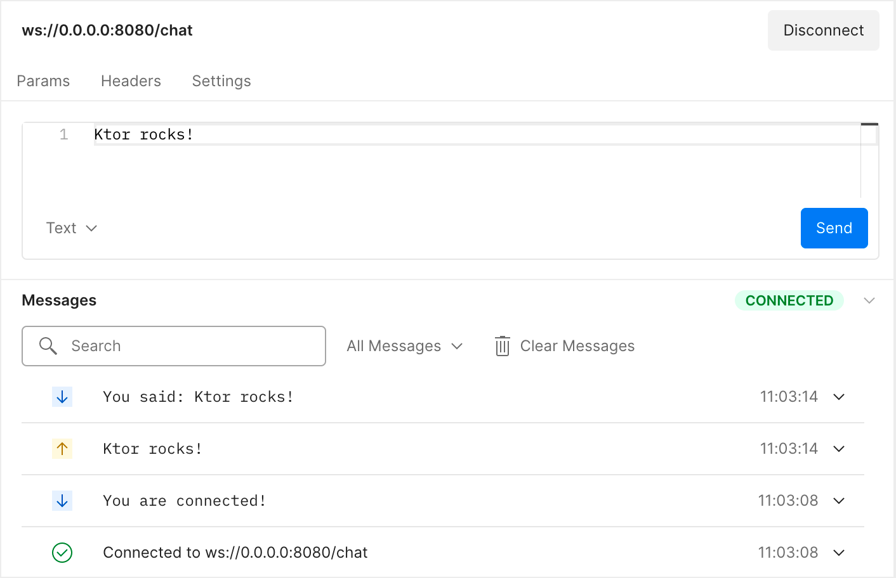

# Creating a WebSocket chat

このハンズオンでは、WebSocketを使用する簡単なチャットアプリケーションを作成する方法を学習します。 Webアプリケーションを作成するための非同期KotlinフレームワークであるKtorを使用して、クライアントアプリケーションとサーバーアプリケーションの両方を開発します。j

## 【What we will build】

このチュートリアル全体を通して、2つのアプリケーションで構成される簡単なチャットサービスを実装します。

- `チャットサーバーアプリケーション`は、**チャットユーザーからの接続を受け入れて管理し、メッセージを受信して、接続されているすべてのクライアントに配信**します。


- `チャットクライアントアプリケーション`を使用すると、**ユーザーは共通のチャットサーバーに参加したり、他のユーザーにメッセージを送信したり、ターミナルで他のユーザーからのメッセージを表示**したりできます。

アプリケーションの両方の部分で、KtorのWebSocketのサポートを利用します。 Ktorはサーバー側とクライアント側の両方のフレームワークであるため、クライアントの構築に関しては、チャットサーバーの構築で得た知識を再利用できます。 このハンズオンを完了すると、KtorとKotlinを使用してWebSocketを操作する方法、クライアントとサーバー間で情報を交換する方法、および複数の接続を同時に管理する方法の基本的な知識を得ることができます。

## 【Why WebSocket？】

`WebSocket`は、チャットや単純なゲームなどのアプリケーションに最適です。<sl>**チャットセッションは通常長期間有効**であり、クライアントは他の参加者から長期間にわたってメッセージを受信</sl>します。チャットセッションも双方向です。クライアントはチャットメッセージを送信し、他の人からのチャットメッセージを見たいと考えています。

<sl>通常のHTTPリクエストとは異なり、**WebSocket接続は長期間開いたまま**にすることができ、フレームの形式でクライアントとサーバー間でデータを交換するための簡単なインターフェイスを備えています</sl>。フレームは、さまざまなタイプ(text, binary, close, ping/pong)のWebSocketメッセージと考えることができます。 KtorはWebSocketプロトコルを介して高レベルの抽象化を提供するため、テキストフレームとバイナリフレームに集中して、他のフレームの処理をフレームワークに任せることもできます。 WebSocketも広くサポートされているテクノロジーです。最新のブラウザーはすべて、そのままWebSocketを操作でき、WebSocketを操作するためのフレームワークは、多くのプログラミング言語と多くのプラットフォームに存在します。 プロジェクトの実装に使用したいテクノロジーに自信が持てたので、セットアップから始めましょう。

## 【Project setup】

アプリケーションは2つの独立した部分（チャットサーバーとチャットクライアント）になるため、アプリケーションを2つの別個のGradleプロジェクトとして構成します。これら2つのプロジェクトは完全に独立しているため、オンラインのKtor Project Generator、またはIntelliJIDEAのプラグインを使用して手動で作成できます。

テンプレートリポジトリには、プロジェクトを構築するための2つの最低限のGradleプロジェクトが含まれています。クライアントプロジェクトとサーバープロジェクトです。どちらも、ハンズオン全体で必要となる依存関係が事前に構成されているため、Gradle構成に変更を加える必要はありません。 アプリケーションに使用されているアーティファクトを理解することは依然として有益である可能性があるため、2つのプロジェクトとそれらが依存する依存関係を詳しく見ていきましょう。

### [Understanding the project configuration]

2つのプロジェクトには、それぞれ個別の構成ファイルのセットが付属しています。それぞれをもう少し詳しく調べてみましょう。

**Dependencies for the server project**  
サーバーアプリケーションは、server/build.gradle.ktsファイルに3つの依存関係を指定します

- ktor-server-netty  
  `ktor-server-netty`は<l>KtorをNettyエンジンと一緒に追加し、外部のアプリケーションコンテナに依存することなくサーバー機能を使用</l>できるようにします。


- ktor-websockets  
  `ktor-websockets`を使用すると、<l>チャットの主要な通信メカニズムであるWebSocketKtorプラグインを使用</l>できます。


- logback-classic  
  `logback-classic`は<l>SLF4Jの実装を提供し、コンソールで適切にフォーマットされたログを表示</l>できるようにします。

```kotlin
dependencies {
    implementation("io.ktor:ktor-server-netty:$ktor_version")
    implementation("io.ktor:ktor-websockets:$ktor_version")
    implementation("ch.qos.logback:logback-classic:$logback_version")
}
```

### [Configuration for the server project]

Ktorは、HOCON構成ファイルを使用して、エントリポイントや展開ポートなどの基本的な動作を設定します。 `server/src/main/resources/application.conf`にあります。

```
ktor {
    deployment {
        port = 8080
    }
    application {
        modules = [ com.jetbrains.handson.chat.ApplicationKt.module ]
    }
}
```

このファイルのディレクトリには、logback-classic実装を設定する必要最低限のlogback.xmlファイルもあります。

**Dependencies for the client project**  
クライアントアプリケーションは、client /build.gradle.ktsファイルで次の2つの依存関係を指定します。

```kotlin
dependencies {
    implementation("io.ktor:ktor-client-websockets:$ktor_version")
    implementation("io.ktor:ktor-client-cio:$ktor_version")
}
```

- ktor-client-cio  
  `ktor-client-cio`は、<l>コルーチン上にKtorのクライアント実装を提供します（「Coroutine-basedI/O」）</l>。


- ktor-client-websockets  
  `ktor-client-websockets`は、<l>サーバーへのktor-websockets依存関係に対応するものであり、サーバーと同じAPIを使用してクライアントからWebSocketを使用</l>できるようにします。

プロジェクトを実行するための部分についてある程度理解できたので、次はプロジェクトの構築を開始します。簡単なWebSocketechoサーバーを実装することから始めましょう！

## 【A first echo server】

### [implementing an echo server]

WebSocket接続を受け入れ、テキストコンテンツを受信し、それをクライアントに送り返す「echo」サービスを構築することから、サーバー開発の旅を始めましょう。`Application.module（）`の次の実装を`server/src/main/kotlin/com/jetbrains/handson/chat/server/Application.kt`に追加することで、KotlinとKtorでこのサービスを実装できます。

```kotlin
fun Application.module() {
    install(WebSockets)
    routing {
        webSocket("/chat") {
            send("You are connected!")
            for (frame in incoming) {
                frame as? Frame.Text ?: continue
                val receivedText = frame.readText()
                send("You said: $receivedText")
            }
        }
    }
}
```

まず、<sl>WebSockets Ktorプラグインをインストールして、Ktorフレームワークによって提供されるWebSocket関連の機能を有効</sl>にします。これにより、<sl>WebSocketプロトコルに応答するエンドポイントをルーティングで定義</sl>できます（この場合、ルートは/chatです）。 webSocketルート関数のスコープ内で、クライアントと対話するためのさまざまなメソッドを使用できます（DefaultWebSocketServerSessionレシーバータイプを介して）。

これには、<sl>メッセージを送信し、受信したメッセージを反復処理</sl>するための便利な方法が含まれます。 <sl>テキストコンテンツのみに関心があるため、着信チャネルを反復処理するときに受信する非テキストフレームはスキップ</sl>します。次に、<sl>受信したテキストを読み取り、「Yousaid：」というプレフィックスを付けてユーザーに送り返します</sl>。

この時点で、完全に機能するechoサーバーをすでに構築しています。これは、送信したものをすべて送信するだけの小さなサービスです。やってみよう！

### [Trying out the echo server]

今のところ、WebベースのWebSocketクライアントを使用して、echoサービスに接続し、メッセージを送信し、echoされた応答を受信できます。サーバー側の機能の実装が完了したら、Kotlinで独自のチャットクライアントも構築します。

サーバーのApplication.ktのfun mainの定義の横にあるガターの再生ボタンを押して、サーバーを起動しましょう。プロジェクトのコンパイルが完了すると、サーバーがIntelliJ IDEARunツールウィンドウで実行されていることの確認が表示されます。

`Application - Responding at http://0.0.0.0:8080.`

このサービスを試すには、Postmanを使用して`ws://localhost:8080/chat`に接続し、WebSocketリクエストを作成します。



次に、エディターペインに任意の種類のメッセージを入力して、ローカルサーバーに送信できます。すべてが計画どおりに進んだ場合は、送受信されたメッセージと[メッセージ]ペインが表示され、echoサーバーが意図したとおりに機能していることが示されます。 これにより、WebSocketを介した双方向通信の強固な基盤ができました。次に、チャットサーバーに似たプログラムを拡張して、複数の参加者が他の参加者とメッセージを共有できるようにします。

## 【Exchanging messages】

echoサーバーを実際のチャットサーバーに変えましょう！これを行うには、同じユーザーからのメッセージがすべて同じユーザー名でタグ付けされていることを確認する必要があります。また、メッセージが実際にブロードキャストされ、接続されている他のすべてのユーザーに送信されることを確認する必要があります。

**Modeling connections**

これらの機能は両方とも、サーバーが保持している接続を追跡できる必要があります。つまり、どのユーザーがメッセージを送信しているか、誰にメッセージをブロードキャストするかを知る必要があります。 Ktorは、DefaultWebSocketSessionタイプのオブジェクトとのWebSocket接続を管理します。このオブジェクトには、着信チャネルと発信チャネル、通信の便利なメソッドなど、WebSocketを介した通信に必要なすべてのものが含まれています。今のところ、ユーザー名の割り当ての問題を単純化し、各参加者にカウンターに基づいて自動生成されたユーザー名を与えることができます。次の実装をserver / src / main / kotlin / com / jetbrains / handson / chat / server /のConnection.ktという名前の新しいファイルに追加します。
